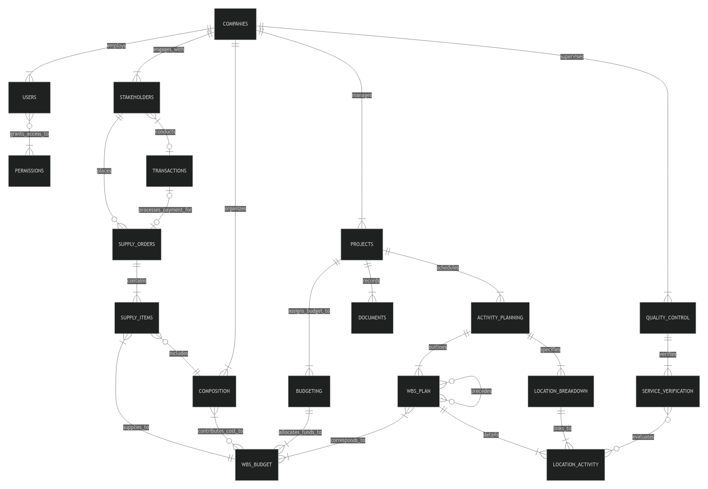

# Design Document

By Lucas Rollin Ferreira

Video overview: [Hardplan ERP](https://youtu.be/vklCDvtNvaE)

## Scope

**Hardplan ERP** is a robust database designed to support the core functionalities of an Enterprise Resource Planning (ERP) system tailored specifically for construction companies. The database is structured to handle key operational areas such as project management, budgeting, resource planning, and financial oversight. Its goal is to provide a comprehensive solution for efficiently managing construction projects while integrating financial and supply chain management seamlessly. The database also ensures that user roles and permissions are tightly controlled, offering different levels of access and functionality based on user needs.

### In-Scope Modules

1. **User Management and Permissions**
   The system manages multiple users with distinct roles and permissions. This allows for fine-grained control over who can view, edit, or manage specific data within the ERP system, ensuring security and compliance with organizational policies.
2. **Financial Module**
   Tracks all financial transactions, including inflows (e.g., payments from clients) and outflows (e.g., supplier payments, labor cost). This module serves as a central ledger for the company, allowing managers to monitor cash flow and profitability.
3. **Commercial Module**
   Streamlines client information management, allowing efficient recording and updating of client details to maintain relationships with key stakeholders involved in projects.
4. **Supply Chain Module**
   Manages supplier and labor information while tracking supply orders. It supports procurement processes, ensuring timely ordering and delivery of necessary materials.
5. **Project Management**
   Facilitates the creation of new projects, enabling teams to initiate and manage construction projects from start to finish. Each project is tracked with its unique identifier and related data, including budgeting and schedules.
6. **Planning Module**
   Supports Work Breakdown Structure (WBS) and Location Breakdown Structure (LBS) planning, crucial for scheduling and resource allocation. It ensures organized project execution by tracking essential planning data.
7. **Budgeting Module**
   Provides WBS-based budgeting, enabling precise tracking of project costs through synthetic and analytic compositions. Synthetic compositions group activities, while analytic compositions focus on individual resources, offering detailed cost analysis for each task.
8. **Quality Control Module**
   Stores Service Verification Sheets and tracks activity and location-based verifications, ensuring quality is maintained throughout project execution.

### Out of Scope

1. **Detailed Commercial Tracking**
   While the database includes basic client information, it does not extend into advanced commercial functionalities such as customer relationship management (CRM), lead tracking, or sales analytics.

This scope definition focuses on delivering a fully functional and scalable database to manage the essential aspects of construction projects, excluding non-core features such as detailed commercial tracking that may be handled by other systems.

## Functional Requirements

This database will support the following user functionalities:

* **Project Management**: Users will be able to create new projects, assign tasks, and store relevant project documents. Each project will include essential details like project scope, timelines, and associated stakeholders.
* **Budgeting and Scheduling**: Users can create multiple versions of project budgets and schedules. This allows for version control and comparison between different iterations, helping to track how project costs and timelines evolve over time.
* **Supply Chain and Resource Tracking**: Users will be able to track supply orders for both materials and labor. The database will store information on suppliers, order statuses, delivery dates, and costs, ensuring a streamlined procurement process.
* **Compositions Management**: Users will create and manage both synthetic compositions (aggregating multiple activities) and analytic compositions (individual resources like labor and materials). This breakdown allows for detailed cost tracking at both the activity and resource levels.
* **Service Inspections**: Users will register service inspections by creating service verification sheets that document inspections related to the quality of work, ensuring that all activities meet the necessary standards.
* **Transaction Management**: Users will register and track all financial transactions between the company and stakeholders, such as clients and suppliers. This includes logging payments, invoices, and other financial exchanges for auditing and reporting purposes.

This version of the project does not support:

* **Advanced CRM Features**: Detailed customer relationship management, such as lead tracking, marketing automation, or personalized customer communications, is beyond the scope of this database. Only basic stakeholder information will be stored.
* **Construction Site Logistics**: This version will not manage on-site logistics such as equipment scheduling, workforce assignments, or detailed site planning.

## Representation

Entities are captured in **PostgreSQL** tables and views with the following schema, grouped by their respective modules for clarity.

### Entities Overview

| Module             | Table Name                      | Description                                     |
| ------------------ | ------------------------------- | ----------------------------------------------- |
| Core               | `companies`                   | Stores company information                      |
|                    | `users`                       | Stores user data                                |
|                    | `permission`                  | Stores permission types                         |
|                    | `user_permissions`            | Manages user permissions                        |
| Project Management | `projects`                    | Contains project information                    |
|                    | `documents`                   | Stores project-related documents                |
| Budgeting          | `budgeting`                   | Manages project budgets                         |
|                    | `wbs_budget`                  | Work Breakdown Structure for budget items       |
|                    | `composition_analytic`        | Stores detailed material and labor compositions |
|                    | `composition_synthetic`       | Stores high-level activity compositions         |
|                    | `composition`                 | Links synthetic and analytic compositions       |
|                    | `wbs_composition`             | Connects budgets with compositions              |
| Activity Planning  | `activity_planning`           | Handles activity planning and task breakdown    |
|                    | `location_breakdown`          | Manages project locations                       |
|                    | `wbs_plan`                    | Work Breakdown Structure for tasks              |
|                    | `predecessors`                | Tracks task dependencies                        |
|                    | `location_activity`           | Manages progress and where tasks happen         |
|                    | `wbs_budget_plan`             | Links the budgeting and planning WBS            |
| Quality Control    | `service_verification_sheets` | Tracks service verification sheets              |
|                    | `service_verification_sheet`  | Items within a service verification sheet       |
|                    | `service_check`               | Links verification items with task executions   |
| Supply Chain       | `stakeholders`                | Stores stakeholder data (clients, suppliers)    |
|                    | `supply_orders`               | Tracks supply orders                            |
|                    | `supply_items`                | Manages items in supply orders                  |
| Finance            | `transactions`                | Tracks financial transactions                   |

### Entities

The database includes the following entities, represented in tables:

#### Companies

The `companies` table includes:

* `id`, which represents the unique id of a company as a `SERIAL`. This column has the `PRIMARY KEY` constraint applied.
* `name`, which represents the company name as a `VARCHAR(64)`.
* `date`, which represents the date the company subscribed to Hardplan ERP as a `DATE`. The default value for this value is the current timestamp, as denoted by `DEFAULT CURRENT_TIMESTAMP`.
* `discription`, which represents an optional discription for the company as a `TEXT`.

All columns in the `companies` table, except the `discription` column, are required and hence have the `NOT NULL` constraint applied.

#### Users

The `users` table includes:

* `id`, which represents the unique id of a user as a `SERIAL`. This column has the `PRIMARY KEY` constraint applied.
* `company_id`, which associates the user to a company as an `INTEGER`. This column has the `FOREIGN KEY` constraint applied, referencing the `id` column in the `companies` table to ensure data integrity.
* `name`, which represents the username as a `VARCHAR(32)`.
* `password_hash`, which represents the user password hash as a `CHAR(512)`. The size choice was made for the use of the HASH_SHA512 algorithm to hash passwords.

All columns in the `users` table are required and hence have the `NOT NULL` constraint applied.

#### Permissions

The `permissions` table includes:

* `id`, which represents the unique id of a permission as a `SERIAL`. This column has the `PRIMARY KEY` constraint applied.
* `name`, which represents the possible permissions an user can have as a `permission` type. This column has a `NOT NULL` constraint applied to ensure validity.

The `permissions` type includes these possible values: _admin_, _budgeting_, _planning_, _financial_, _commercial_, _supply_, _quality_.

This table should be initialize once and remain unchanged until a permission needs to be added or removed.

#### User Permissions

The `user_permissions` table includes:

* `user_id`, which represents an user as an `INTEGER`. This column has the `FOREIGN KEY` constraint applied, referencing the `id` column in the `users` table to ensure data integrity.
* `permission_id`, which represents a permission as an `INTEGER`. This column has the `FOREIGN KEY` constraint applied, referencing the `id` column in the `permission` table to ensure data integrity.

Together, the `user_id` and `permission_id` columns form a composite `PRIMARY KEY` for the composition table, ensuring that each combination of user and permission is unique.

The `user_permissions` table ensures each user can have a set of the possible permissions.

#### Projects

The `projects` table includes:

* `id`, which represents the unique id of a project as a `SERIAL`. This column has the `PRIMARY KEY` constraint applied.
* `company_id`, which associates the project to a company as an `INTEGER`. This column has the `FOREIGN KEY` constraint applied, referencing the `id` column in the `companies` table to ensure data integrity.
* `code`, which represents the code companies can use to internally identify their projects as a `VARCHAR(32)`.
* `name`, which represents the project name as a `VARCHAR(64)`.
* `discription`, which represents a discription for the project as a `TEXT`.
* `status`, which represents the project's current standing as a `VARCHAR(18)`. This column has a `CHECK` constraint applied ensure it can only be assume values 'under construction', 'under evaluation' or 'closed'.

All columns in the `projects` table, except the `discription` column, are required and hence have the `NOT NULL` constraint applied.

The column combination (`company_id`, `code`) have a `UNIQUE` constraint applied to ensure a company can only have unique codes while allowing different companies to pick the same code.

#### Documents

The `documents` table includes:

* `id`, which represents the unique id of a document as a `SERIAL`. This column has the `PRIMARY KEY` constraint applied.
* `project_id`, which associates the document to a project as an `INTEGER`. This column has the `FOREIGN KEY` constraint applied, referencing the `id` column in the `companies` table to ensure data integrity. This column is also set to `ON DELETE CASCADE` for referencial integrity.
* `name`, which represents the document name as a `VARCHAR(32)`.
* `type`, which represents the document classification as a `VARCHAR(32)`.
* `date`, which represents the document's date as a `DATE`. The default value for this value is the current timestamp, as denoted by `DEFAULT CURRENT_TIMESTAMP`.
* `document`, which represents the document itself with it's original format  as a `BYTEA`.

All columns in the `documents` table are required and hence have the `NOT NULL` constraint applied.

#### Stakeholders

The `stakeholders` table includes:

* `id`, which represents the unique id of a stakeholder as a `SERIAL`. This column has the `PRIMARY KEY` constraint applied.
* `company_id`, which associates the project to a company as an `INTEGER`. This column has the `FOREIGN KEY` constraint applied, referencing the `id` column in the `companies` table to ensure data integrity.
* `name`, which represents the full name of the stakeholder as a `VARCHAR(32)`.
* `email`, which represents the stakeholder's email address as a `VARCHAR(64)`.
* `phone`, which represents the stakeholder's phone as a `VARCHAR(20)`.
* `type`, which represents the stakeholder's classification as a `VARCHAR(8)`. This column has a `CHECK` constraint applied ensure it can only be assume values 'client', 'supplier' or 'labor'.
* `discription`, which represents a discription that further specifies the stakeholder's role a `TEXT`.

All columns in the `stakeholders` table, except the `discription` column, are required and hence have the `NOT NULL` constraint applied.

#### Budgeting

The `budgeting` table includes:

* `id`, which represents the unique id of a budget as a `SERIAL`. This column has the `PRIMARY KEY` constraint applied.
* `project_id`, which associates the budget to a project as an `INTEGER`. This column has the `FOREIGN KEY` constraint applied, referencing the `id` column in the `companies` table to ensure data integrity. This column is also set to `ON DELETE CASCADE` for referencial integrity.
* `name`, which represents the name of the budget as a `VARCHAR(32)`.
* `version`, which represents the budget version as an `INTEGER`.

All columns in the `budgeting` table are required and hence have the `NOT NULL` constraint applied.

#### Analytic Composition

The `composition_analytic` table includes:

* `id`, which represents the unique id of a budget as a `SERIAL`. This column has the `PRIMARY KEY` constraint applied.
* `company_id`, which associates the analytic composition to a company as an `INTEGER`. This column has the `FOREIGN KEY` constraint applied, referencing the `id` column in the `companies` table to ensure data integrity.
* `task_name`, which represents the material or labor name as a `VARCHAR(32)`.
* `unit`, which represents the standard measurement unit for that material or labor as a `VARCHAR(32)`.
* `unit_cost`, which represents the unitary cost of the specified unit of material or labor as a `NUMERIC(12, 2)`. An exact numeric type was chosen since this column is used to calculate a project's cost.

All columns in the `composition_analytic` table are required and hence have the `NOT NULL` constraint applied.

#### Synthetic Composition

The `composition_synthetic` table includes:

* `id`, which represents the unique id of a budget as a `SERIAL`. This column has the `PRIMARY KEY` constraint applied.
* `company_id`, which associates the synthetic composition to a company as an `INTEGER`. This column has the `FOREIGN KEY` constraint applied, referencing the `id` column in the `companies` table to ensure data integrity.
* `task_name`, which represents the activity name as a `VARCHAR(32)`.
* `unit`, which represents the standard measurement unit for the acitivty as a `VARCHAR(32)`.

All columns in the `composition_synthetic` table are required and hence have the `NOT NULL` constraint applied.

#### Composition

The `composition` table includes:

* `synthetic_id`, which represents the activity as an `INTEGER`. This column has the `FOREIGN KEY` constraint applied, referencing the `id` column in the `composition_synthetic` table to ensure data integrity.
* `analytic_id`, which represents the material or labor as an `INTEGER`. This column has the `FOREIGN KEY` constraint applied, referencing the `id` column in the `composition_analytic` table to ensure data integrity.
* `quantity`, which represents the amount of material or labor, based on the standard measurement unit, need to concluded one unit of the activity. This column has the `NOT NULL` constraint applied.

Together, the `synthetic_id` and `analytic_id` columns form a composite `PRIMARY KEY` for the composition table, ensuring that each combination of synthetic and analytic compositions is unique. Both columns are also set to `ON DELETE CASCADE` for referencial integrity.

The columns

#### Budgeting Work Breakdown Structure

The `wbs_budget` table includes:

* `id`, which represents the unique id of a task as a `SERIAL`. This column has the `PRIMARY KEY` constraint applied.
* `budget_id`, which associates the task to a budget as an `INTEGER`. This column has the `FOREIGN KEY` constraint applied, referencing the `id` column in the `budgeting` table to ensure data integrity. This column is also set to `ON DELETE CASCADE` for referencial integrity.
* `task`, which represents an activity name as a `VARCHAR(32)`.

All columns in the `stakeholders` table are required and hence have the `NOT NULL` constraint applied.

#### WBS-Composition

The `wbs_composition` table includes:

* `id`, which represents the unique id of a task as a `SERIAL`. This column has the `PRIMARY KEY` constraint applied.
* `wbs_budget_it`, which associates the composition table to a budgeting item as an `INTEGER`. This column has the `FOREIGN KEY` constraint applied, referencing the `id` column in the `wbs_budget` table to ensure data integrity.
* `analytic_id`, which represents an analytic composition table linked to the task as an `INTEGER`. This column has the `FOREIGN KEY` constraint applied, referencing the `id` column in the `composition_analytic` table to ensure data integrity.
* `synthetic_id`, which represents a synthetic composition table linked to the task as an `INTEGER`. This column has the `FOREIGN KEY` constraint applied, referencing the `id` column in the `composition_synthetic` table to ensure data integrity.
* `work_quantity`, which represents the amount of work necessary to complete a task as a `NUMERIC(12, 2)`.

The column combination (`wbs_budget_it`, `analytic_id`, `synthetic_id`) have a `UNIQUE` constraint applied to ensure the uniqueness of each association. The three columns are also set to `ON DELETE CASCADE` for referencial integrity.

There is a `CHECK` constraint applied such that either `analytic_id` or `synthetic_id` is `NULL` but not both. This is made to assure an budgeting item is linked to one composition at a time.

The columns `wbs_budget_id` and `work_quantity` are required and thus have the `NOT NULL` constraint applied..

#### Activity Planning

The `activity_planning` table includes:

* `id`, which represents the unique id of a plan or schedule as a `SERIAL`. This column has the `PRIMARY KEY` constraint applied.
* `project_id`, which associates the plan to a project as an `INTEGER`. This column has the `FOREIGN KEY` constraint applied, referencing the `id` column in the `companies` table to ensure data integrity. This column is also set to `ON DELETE CASCADE` for referencial integrity.
* `name`, which represents the name of the plan as as `VARCHAR(32)`.
* `version`, which represents the budget version as an `INTEGER`.

All columns in the `activity_planning` table are required and hence have the `NOT NULL` constraint applied.

#### Location Breakdwon Structure

The `location_breakdown` table includes:

* `id`, which represents the unique id of a plan or schedule as a `SERIAL`. This column has the `PRIMARY KEY` constraint applied.
* `plan_id`, which associates the location to a plan as an `INTEGER`. This column has the `FOREIGN KEY` constraint applied, referencing the `id` column in the `activity_planning` table to ensure data integrity. This column is also set to `ON DELETE CASCADE` for referencial integrity.
* `location`, which represents the location name as a `VARCHAR(32)`.

All columns in the `location_breakdown` table are required and hence have the `NOT NULL` constraint applied.

The column combination (`plan_id`, `location`) have a `UNIQUE` constraint applied to ensure a plan can only have unique locations while allowing different plans to pick the same location name.

#### Planning Work Breakdown Structure

The `wbs_plan` table includes:

* `id`, which represents the unique id of a task as a `SERIAL`. This column has the `PRIMARY KEY` constraint applied.
* `plan_id`, which associates the location to a plan as an `INTEGER`. This column has the `FOREIGN KEY` constraint applied, referencing the `id` column in the `activity_planning` table to ensure data integrity. This column is also set to `ON DELETE CASCADE` for referencial integrity.
* `task`, which represents the activity name as a `VARCHAR(32)`.
* `duration`, which represents the task duration as a `REAL`.
* `start_time`, which represents the execution starting time as a `DATE`.
* `end_time`, which represents the execution conclusion time as a `DATE`.
* `ES`, which represents the Earliest Start Critical Path Method (CPM) attribute as a `DATE`.
* `EF`, which represents the Earliest Finish CPM attribute as a `DATE`.
* `LS`, which represents the Late Start CPM attribute as a `DATE`.
* `LF`, which represents the Late Finish CPM attribute as a `DATE`.
* `slack`, which represents the slack CPM attribute as a `REAL`.
* `critical`, which represents wether the task is critical or not as a `SMALLINT`. This column has a `CHECK` constraint to ensure the value is either 0 for non-critical or 1 for critical.

Only the columns `plan_id`, `task` and `duration` have the `NOT NULL` constraint. The intent is to insert new tasks using only these columns and later update the other columns after the CPM algorithm calculates their values.

#### Predecessors

The `predecessors` table includes:

* `task_id`, which represents a task as an `INTEGER`. This column has the `FOREIGN KEY` constraint applied, referencing the `id` column in the `wbs_plan` table to ensure data integrity.
* `predecessor_id`, which represents a predecessor to said task the as an `INTEGER`. This column has the `FOREIGN KEY` constraint applied, referencing the `id` column in the `wbs_plan` table to ensure data integrity.

There is a `CHECK` constraint applied to ensure `task_id` is different than `predecessor_id` making sure a task doesn't reference itself as a predecessor.

Together, the `task_id` and `predecessor_id` columns form a composite `PRIMARY KEY` for the `wbs_plan` table, ensuring that each combination of task and predecessor is unique. Both columns are also set to `ON DELETE CASCADE` for referencial integrity.

#### Work Breakdown Structure Budget-Plan

The `wbs_budget_plan` table includes:

* `wbs_plan_id`, which represents a planning task as an `INTEGER`. This column has the `FOREIGN KEY` constraint applied, referencing the `id` column in the `wbs_plan` table to ensure data integrity.
* `wbs_budget_id`, which represents a budgeting task as an `INTEGER`. This column has the `FOREIGN KEY` constraint applied, referencing the `id` column in the `wbs_budget` table to ensure data integrity.

Together, the `wbs_task_id` and `wbs_budget_id` columns form a composite `PRIMARY KEY` for the `wbs_plan` table, ensuring that each combination of task and predecessor is unique. Both columns are also set to `ON DELETE CASCADE` for referencial integrity.

The idea is to allow companies to have different levels of detail between the WBS used for planning and budgeting. It still allows for best practices, which is having a single WBS, equivalent to having a one to one relationship between the `wbs_plan` and `wbs_budget` tables.

#### Location-Activity

The `location_activity` table includes:

* `id`, which represents the unique id of a location-activity pair as a `SERIAL`. This column has the `PRIMARY KEY` constraint applied.
* `activity_id`, which represents a activity as an `INTEGER`. This column has the `FOREIGN KEY` constraint applied, referencing the `id` column in the `wbs_plan` table to ensure data integrity. This column is also set to `ON DELETE CASCADE` for referencial integrity.
* `location_id`, which represents a location as an `INTEGER`. This column has the `FOREIGN KEY` constraint applied, referencing the `id` column in the `location_breakdown` table to ensure data integrity. This column is also set to `ON DELETE CASCADE` for referencial integrity.
* `start_time`, which represents the execution starting time as a `DATE`.
* `end_time`, which represents the execution conclusion time as a `DATE`.
* `progress`, which represents the progress towards completing the taks as a `NUMERIC(3, 2)`. This column has `CHECK` constraint applied to ensure the progress value is between `0.00` (no progress) and `1.00` (fully completed), with a default value that represents no progress, as denoted by `DEFAULT 0`.

All columns in the `location_activity` table, except the `progress` column, are required and hence have the `NOT NULL` constraint applied.

This table plays a central role in project progress tracking, as it links activities with specific locations. The progress recorded here can be aggregated in the `wbs_plan`, `wbs_budget`, and `location_breakdown` tables to provide an overall view of task completion across the entire project. This modular approach allows for detailed monitoring of both location-specific and project-wide progress.

#### Service Verification Sheets

The `service_verification_sheets` table includes:

* `id`, which represents the unique id of a service verification sheet as a `SERIAL`. This column has the `PRIMARY KEY` constraint applied.
* `company_id`, which associates the service verification sheet to a company as an `INTEGER`. This column has the `FOREIGN KEY` constraint applied, referencing the `id` column in the `companies` table to ensure data integrity. This column is also set to `ON DELETE CASCADE` for referencial integrity.
* `name`, which represents the service verification sheet name as a `VARCHAR(64)`.
* `version`, which represents the service verification sheet name as an `INTEGER`.

All columns in the `service_verification_sheets` table are required and hence have the `NOT NULL` constraint applied.

#### Service Verification Sheet

The `service_verification_sheet` table inlcudes:

* `id`, which represents the unique id of a service verification sheet as a `SERIAL`. This column has the `PRIMARY KEY` constraint applied.
* `sheet_id`, which associates the service verification item to a service verification sheet as an `INTEGER`. This column has the `FOREIGN KEY` constraint applied, referencing the `id` column in the ``service_verification_sheets`` table to ensure data integrity. This column is also set to `ON DELETE CASCADE` for referencial integrity.
* `item`, the service verificaiton item name as a `VARCHAR(64)`.
* `check_method`, the verification procedure as a `VARCHAR(64)`.
* `tolerance`, the tolerance margin for the verification as a `VARCHAR(16)`.

All columns in the `service_verification_sheet` table are required and hence have the `NOT NULL` constraint applied.

#### Service Check

The `service_check` table includes:

* `service_item_id`, which represents a service verification item as an `INTEGER`. This column has the `FOREIGN KEY` constraint applied, referencing the `id` column in the `service_verification` table to ensure data integrity.
* `location_activity_id`, which represents a location-activity pair as an `INTEGER`. This column has the `FOREIGN KEY` constraint applied, referencing the `id` column in the `location_activity` table to ensure data integrity.
* `date`, which represents the verification date as a `DATE`. The default value for this value is the current timestamp, as denoted by `DEFAULT CURRENT_TIMESTAMP`.
* `status`, which represents the check result as a `CHAR(4)`. This column has a `CHECK` constraint applied to ensure it can only assume values 'Pass' or 'Fail'.
* `observation`, which represents any additional obversation about the verification as a `TEXT`.

Together, the `service_item_id` and `location_activity_id` columns form a composite `PRIMARY KEY` for the `service_check` table, ensuring that each combination of service verification item and location-activity is unique. Both columns are also set to `ON DELETE CASCADE` for referencial integrity.

All columns in the `service_verification` table, except the `observation` column, are required and hence have the `NOT NULL` constraint applied.

#### Supply Orders

The `supply_orders` table includes:

* `id`, which represents the unique id of a service verification sheet as a `SERIAL`. This column has the `PRIMARY KEY` constraint applied.
* `stakeholder_id`, which associates the supply order to a stakeholder as an `INTEGER`. This column has the `FOREIGN KEY` constraint applied, referencing the `id` column in the `stakeholders` table to ensure data integrity.
* `delivery_date`, which represents the expected delivery date of the supply order as a `DATE`. This is column should be `NULL` for labor.
* `status`, which represents the delivery status as a `VARCHAR(22)`. This column has a `CHECK` constraint applied to ensure it can only assume values 'pending', 'delivered', 'canceled' or `NULL`. This column should be `NULL` for labor.

All columns in the `supply_orders` table, except the `delivery_date` and `status` columns, are required and hence have the `NOT NULL` constraint applied.

#### Supply Items

The `supply_items` table includes:

* `order_id`, which associates the supply item to a supply order as an `INTEGER`. This column has the `FOREIGN KEY` constraint applied, referencing the `id` column in the `supply_orders` table to ensure data integrity.
* `analytic_id`, which associates the supply item to an analytic composition item as an `INTEGER`. This column has the `FOREIGN KEY` constraint applied, referencing the `id` column in the `composition_analytic` table to ensure data integrity.
* `wbs_budget_id`, which associates the supply item to an item in the budgeting WBS task as an `INTEGER`. This column has the `FOREIGN KEY` constraint applied, referencing the `id` column in the `wbs_budgeting` table to ensure data integrity.
* `quantity`, which represents the delivery amount of material or man-hour of labor as a `NUMERIC(12, 2)`. This column is mandatory an thus has the `NOT NULL` constraint applied.

Together, the `order_id`, `analytic_id` and `wbs_budget_id` columns form a composite `PRIMARY KEY` for the `supply_items` table, ensuring that each combination supply item, analytic composition item and budgeting WBS task is unique.

#### Transactions

The `transactions` table includes:

* `id`, which represents the unique id of a transaction as a `SERIAL`. This column has the `PRIMARY KEY` constraint applied.
* `transaction_type`, which represents the transaction type as a `flow`, which includes these possible values: 'inflow' and 'outflow'.
* `stakeholder_id`, which associates the transaction to a stakeholder as an `INTEGER`. This column has the `FOREIGN KEY` constraint applied, referencing the `id` column in the `stakeholders` table to ensure data integrity.
* `supply_id`, which associates the transaction to a supply order as an `INTEGER`. This column has the `FOREIGN KEY` constraint applied, referencing the `id` column in the `supply_orders` table to ensure data integrity.
* `amount`, which represents the amount paid as a `NUMERIC(12,2)`.
* `transaction_date`, which represents the transaction date as a `DATE`. The default value for this value is the current timestamp, as denoted by `DEFAULT CURRENT_TIMESTAMP`.
* `discription`, which represents the optional transaction discription as a `TEXT`.

All columns in the `supply_orders` table are required and hence have the `NOT NULL` constraint applied, with these expections:

1. `supply_id` can be `NULL` if it's not related to a supply order, being either an administrative related cost or a revenue.
2. `discription` is optional and thus can be left `NULL`.

### Views

In addition to tables, the database includes views, which are virtual representations of data created by joining or aggregating multiple tables. Views provide a way to simplify complex queries and ensure that users can easily retrieve the necessary information without directly interacting with the base tables.

The database includes the following views:

#### Full Composition

The `full_composition` view abstracts the need to join the tables `composition_synthetic`, `composition_analytic` and `composition` and includes:

* `synthetic_id`, which references the `id` in `composition_synthetic`.
* `analytic_id`, which references the `id` in `composition_analytic`.
* `activity`, which represents the macro activity this item constitutes. It's associated with the `task_name` column in `composition_synthetic`.
* `labor_material`, which represents the name of the labor or material used in this item. It's associated with the `task_name` column in `composition_analytic`.
* `unit`, which represents the measurement unit for the used labor of material. It's associated with the `unit` column in `composition_analytic`.
* `quantity`, which represents the amount of labor or material needed to complete one unit of the activity. It's associated with the `quantity` column in `composition`.
* `unit_cost`, which represents the unitary cost of labor or material. It's associated with the `unit_cost` column in `composition_analytic`.

#### Total Cost

The `total_cost` view is designed to provide a comprehensive overview of the total costs associated with each task in a WBS from the `wbs_budget` table. It calculates the total cost for each budgeting task by aggregating values from different cost components: synthetic activities (aggregating costs related to activity compositions) and analytic activities (aggregating costs related to direct resources like materials or labor). The view includes:

* `id`: Represents the unique identifier for each budgeting task. This column references the `id` in the `wbs_budget` table.
* `synthetic_total`:

  * This column shows the sum of all costs associated with synthetic activities (tasks that reference synthetic compositions). It is calculated by joining the `wbs_budget` table with the `full_composition` view, which gives access to the full details of a synthetic composition.
  * Cost Calculation: The cost is determined by multiplying the following elements for each composition:
    * `unit_cost`: The cost per unit of the material or labor.
    * `quantity`: The number of resource units needed for one unit of the activity.
    * `work_quantity`: The total quantity of work required for the task.
  * These multiplied values are then summed for each task, grouped by `wbs_budget_id` (the ID of the budgeting task).
  * If no synthetic activities exist for a particular task, the `COALESCE` function ensures that `synthetic_total` is displayed as `0` instead of `NULL`.
* `analytic_total`:

  * This column shows the sum of all costs associated with analytic activities, such as direct resources like labor or materials. It is calculated by joining the `wbs_budget` table with the `composition_analytic` table.
  * The cost for analytic activities is determined by multiplying `unit_cost` and `work_quantity` for each resource associated with a task. These values are summed and grouped by `wbs_budget_id`.
  * Cost Calculation: The cost is calculated by multiplying:

    * `unit_cost`: The per-unit cost of the material or labor.
    * `work_quantity`: The total amount of work needed for the task.
  * These values are summed for each analytic task, grouped by `wbs_budget_id`.
  * Similarly to `synthetic_total`, the `COALESCE` function is applied to ensure the value is `0` if no analytic costs exist for a task.

### Relationships

The below entity relationship diagram describes the relationships among the entities in the database.



The diagram can be broken down in a few clusters:

* **Company and User Registration** includes the `companies`, `users` and `permissions` tables.
* **Project and Documents** includes the `projects` and `documents` tables.
* **Budgeting Module** includes the `budgeting`, `wbs_budget` and the three `composition` tables.
* **Planning Module** includes the `activity_planning`, `wbs_planning`, `location_breakdown` and `location_activity` tables.
* **Quality Control Module** includes the `service_verification_sheets` and `service_verification_sheet` tables.
* **Supply Module** includes the `supply_orders`, `supply_items`, `stakeholders` and `transactions` tables.

#### Company and User Registration

The Company and User Registration cluster defines the core relationships needed to manage company accounts and their respective users within the system. It includes the following relations:

* The `companies` table is the root node. A company can have 1 or more `users` of the software, thus requiring a one-to-many relationship.
* Users can have 1 or more permissions, similarly a permission can be granted to multiple users. This was achieved by creating a many-to-many relationship between `users` and `permissions` since PostgreSQL doesn't support the `SET` type like MySQL does.
* A single company can have 1 or more projects, transactions, stakeholders and composition tables. Thus it requires a relationship of one-to-many with the tables `projects`, `stakeholders`, `composition` and `service_verification_sheets`.

#### Project and Documents

The Project and Documents cluster focuses on the management of projects and the associated documentation. It includes the following relations:

* A project can have 1 or more documents. Thus requiring a one-to-many relationship between `projects` and `documents`.
* A project can have 1 or more plans and budgets for different versions. Thus requiring a one-to-many relationship between `activity_planning` and `budgeting`.

#### Budgeting Module

The Budgeting Module cluster is designed to manage project budgets and associated compositions. It includes the following relations:

* A budget defines 1 or more items in it's Work Breakdown Structure. Thus requiring a one-to-many relationship between `budgeting` and `wbs_budget`.
* The composition table drawn in the diagram represents the `composition_synthetic`, `composition_analytic` and `composition` tables or the `full_composition` view. The synthetic composition represents activities while the analytic composition defines the material and labor required to execute such activity. Instead of performing a one-to-many relation between these 2 tables it was deemed better to not duplicate any material or labor.The `composition` table realises the many-to-many relation between `composition_synthetic` and `composition_analytic` with the required quantity of material and labor required for each activity.
* It's possible an analytic composition is not referenced by a synthetic composition. One such case happens if a company desires to create an analytic composition to directly represent a currency.
* Each item in the WBS budget can be associated with 1 or more synthetic compositions, or even directly reference analytic compositions. Conversely, both synthetic and analytic compositions can be linked to 0 or more WBS budget items. This many-to-many relationship is realized through the `wbs_composition` table, which serves as the bridge between `wbs_budget`, `composition_synthetic`, and `composition_analytic` tables.

#### Planning Module

The Planning Module cluster addresses how projects are broken down into tasks and locations. It includes the following relations:

* A plan defines 1 or more tasks in it's Work Breakdown Strucure. Thus requiring a one-to-many relationship between `activity_planning` and `wbs_plan`.
* Likewise, a plan defines 1 or more locations in a Location Breakdown Structure. Thus requiring a one-to-many relationship between `activity_planning` and `location_breakdown`.
* An activity has 0 or more predecessors, while a activity can have 0 or more successors. Thus requiring a many-to-many relationship between the table `wbs_plan` and itself. This relation is realised by the `predecessors` table.
* An activity can be execute in 1 or more locations, while a location can also receive 1 or more activities. Thus requiring a many-to-many relationship between the tables `wbs_plan` and `location_breakdown`. This relation is realised by the `location_activity` table.

#### Quality Control Module

The Quality Control Module cluster handles the verification of services and the tracking of execution quality. It includes the following relations:

* A service verification sheet can have 1 or more check items, but a check item can only reference a single service verification sheet. Thus requiring a one-to-many relationhsip between `service_verification_sheets` and `service_verification_sheet`.
* A service verification item can be used check 0 or more executions pairs while an execution can have 0 or more check items. Thus requiring a many-to-many relationship between the tables `location_activity` and `service_verification_sheet`. This relation is realised by the `service_check` table.

#### Supply Module

The Supply Module cluster tracks supply orders, stakeholders, and transactions involved in the procurement process. It includes the following relations:

* A stakeholder can have 0 or more supply orders, having zero orders only when the stakeholder is a client or the supplier or labor hasn't had an order registered yet, but a suply order is always associated with a single stakeholder. Thus requiring a one-to-many relationship between `stakeholders` and `supply_orders`.
* A supply order refers to 1 or more analytic composition items, while an analytic composition is referenced for 0 or more supply orders. Thus requiring a many-to-many relationship between the tables `supply_orders` and `composition_analytic`. This relation is realised by the `supply_items` table.
* A supply order is allocated to 1 or more activities, while an activity can have 1 or more supply orders. Thus requiring a many-to-many relationship between the tables `supply_orders` and `budgeting`. This relation is also satisfied by the `supply_items` table.
* A transaction is linked to a single stakeholder, but a stakeholder can make 0 or more transactions. Thus requiring a one-to-many relationship between the tables `transactions` and `stakeholders`.
* A transaction is authorized after the conclusion of a supply order, if not associated with a client, and a supply order is only related to a single transaction. Thus requiring a one-to-one relationship to between `transactions` and `supply_orders` to trace back the usage of that transaction.

## Optimizations

In order to optimize the performance of common queries and searches in the database, Several indexes were created based on the typical operations performed on certain columns, per the typical queries in `queries.sql`.

Given the frequency of search for companies based on their name, an index was created on the `name` column of the `company` table. This index helps to quickly locate companies by their name:

```sql
CREATE INDEX comapny_name ON "companies" ("name");
```

Similarly, searches for projects by their unique project code are a common query pattern in the system. To enhance the efficiency of these searches, an index was created on the `code` column of the `projects` table:

```sql
CREATE INDEX project_code ON "projects" ("code");
```

For Work Breakdown Structure tasks, it's common to filter tasks by their names. To optimize performance in such scenarios, indexes were created on the `task` columns in both the `wbs_budget` and `wbs_plan` tables:

```sql
CREATE INDEX wbs_budget_task ON "wbs_budget" ("task");
CREATE INDEX wbs_plan_task ON "wbs_plan" ("task");
```

Finally, it's also frequent for searches to filter by the location name. An index was created on the `location` column of the `location_breakdown` table to enhance these searches.

```sql
CREATE INDEX location_name ON "location_breakdown" ("location");
```

## Limitations

The current schema is robust but has a few limitations that could be enhanced for more complex project management scenarios:

1. **Hierarchical Breakdown Structures**: The schema doesn't natively support hierarchical relationships in the Work Breakdown Structure (WBS) or Location Breakdown Structure (LBS). Adding a parent_id column and using recursive queries would allow aggregation of costs and task scheduling across different levels.
2. **Indirect Labor**: Indirect labor, such as supervision or overhead, isn't directly modeled. Currently, indirect labor would need to be handled through analytic compositions, which may lead to confusion. A dedicated system for tracking indirect labor could improve clarity.
3. **Basic Commercial Module**: The commercial module only tracks basic client information and transactions, without features like contract management, CRM, or pricing models. This limits its ability to support more sophisticated commercial operations.
4. **Supply Chain Features**: Advanced supply chain management, such as tracking lead times, handling multiple suppliers per order, or managing inventory, isn't supported. Additional relationships would be needed for these capabilities.

These areas present opportunities for future enhancements that would increase the system's flexibility and capacity for managing more complex projects.
